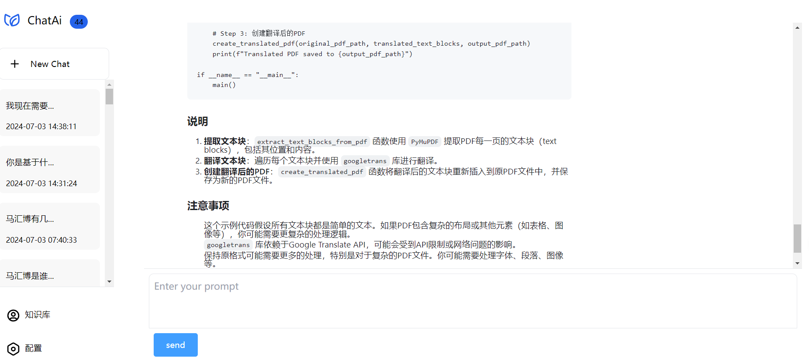
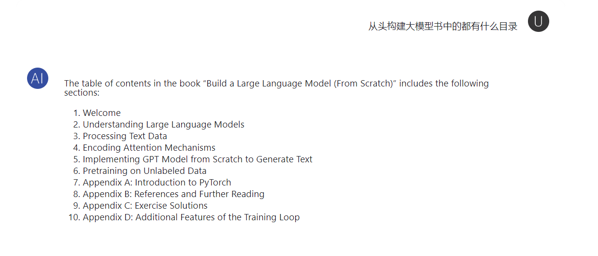
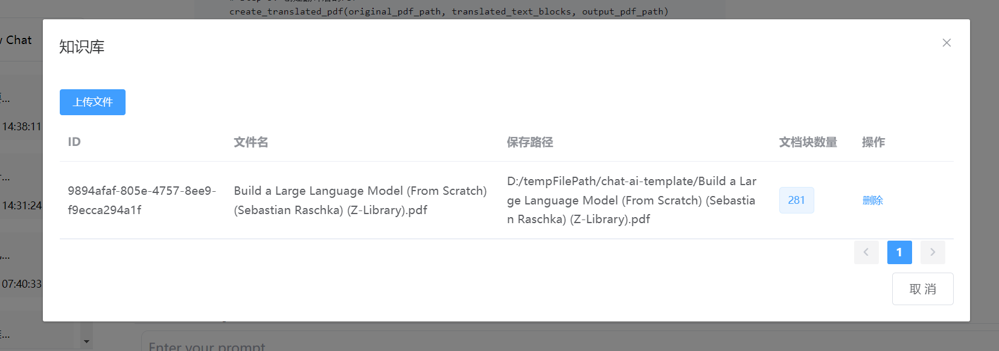
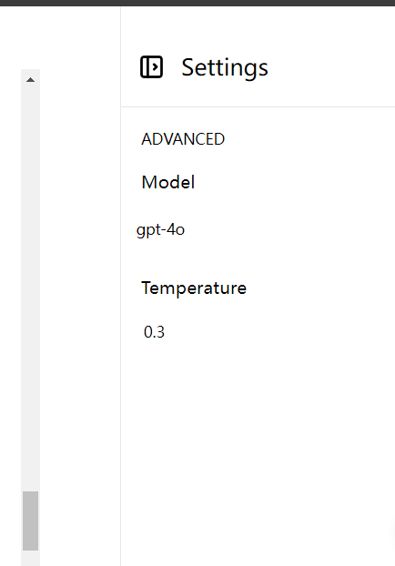

# chat-ai-template

这是一个基于langchain、llama-index、fastApi 前后端分离的RAG和AI聊天的一个学习工程，配置从简，简单易上手

## 框架：
### 前端

| 名称   | 版本    | 备注                         |
| ------ | ------- | ---------------------------- |
| NodeJs | 16.14.2 | 构建时所用版本，建议保持一致 |
| vue    | 2       |                              |

### 后端

| 名称        | 版本            | 备注                         |
| ----------- | --------------- | ---------------------------- |
| Python      | 3.1.2           | 构建时所用版本，建议保持一致 |
| fastapi     | requirement.txt | 用于构建restApi              |
| langchain   | requirement.txt |                              |
| llama-index | requirement.txt | 用于知识库索引               |
| sqllite     |                 | 关系数据库                   |
| chromadb    |                 | 向量数据库                   |


## 功能：

1.设置模型实时切换

2.知识库的维护

3.AI问答

4.基于RAG的聊天


## 运行

### 前端

1.安装 Node Js，建议使用nvm安装管理

教程 ： [nvm详细安装使用教程(nvm-node多版本管理工具）-CSDN博客](https://blog.csdn.net/weixin_57844432/article/details/127788884)

2.安装成功后到 web目录运行

```
npm i
```

3.运行成功后，运行

```
npm run dev
```

见到：

```
  App running at:
  - Local:   http://localhost:8080
  - Network: http://192.168.31.115:8080

```

即启动成功


### 后端

1.修改env文件

```
# sqllite 数据库保存路径
DATABASE_URL="F:\xiangmu\qianduan\chat-ai-template\chat-ai-db\chat-ai.db"
# 向量数据库保存路径
VECTOR_DATABASE_URL="F:\xiangmu\qianduan\chat-ai-template\chat-ai-db"
OPENAI_API_KEY="你的OpenAI API Key"
OPENAI_BASE_URL="open ai 代理地址"
# LlamaIndex 代理关键字
OPENAI_API_BASE="open ai 代理地址"
# 文件保存路径
FILE_LOCAL_PATH="D:/tempFilePath/chat-ai-template"
```
2.安装依赖
```shell
pip install -r requirements.txt
```
安装 chromadb 可能出现问题，参考以下博客解决：

[python安装chromadb出现 error: Microsoft Visual C++ 14.0 or greater is required.. (mhba.work)](https://www.mhba.work/archives/python-an-zhuang-chromadb-chu-xian-errormicrosoftvisualc140orgreaterisrequired)

2.启动

py main.py


## 演示图片：
普通ai聊天：

知识库问答：

知识库维护：

设置：

